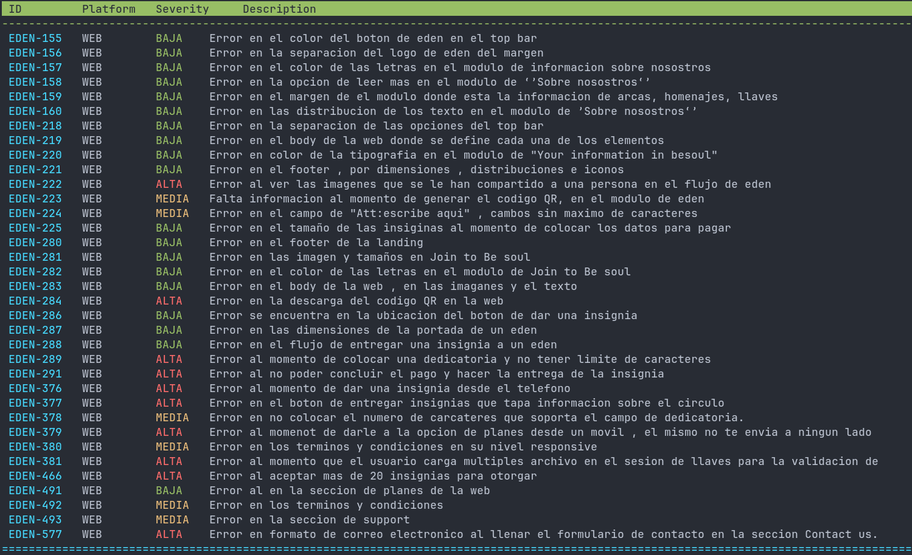

# Evidence



### The problem
Usually QA reports bugs and software malfunctions in a big spreadsheet via Google Drive, describing: platform, current released version and bug severity. That require us scrolling up and down or updating the document to check if any new issue has been reported yet. 

### The solution

Evidence is a small tool that allows you to keep track of QA latests reports without leaving the terminal. So far it only serves for my personal purposes, but is intended to be a general purpose piece of software.

### Try it yourself

```
git clone https://github.com/luisvgs/evidence.git && cd evidence && sbt run
```
